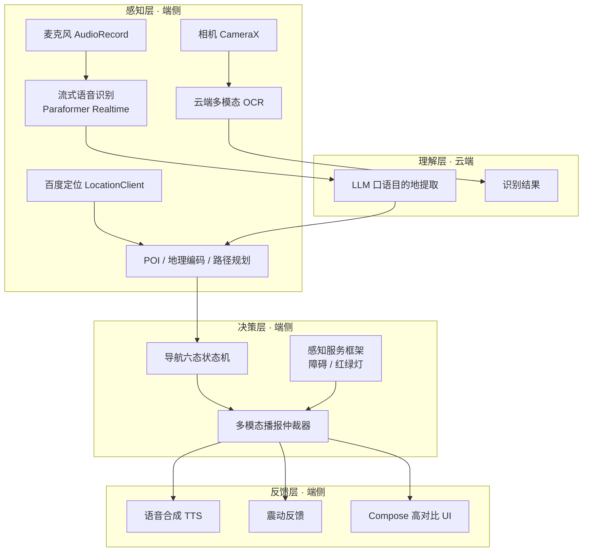

# EarRove聆途——基于多模态感知的视障辅助平台：学术研究论述

> **文档定位**：面向保研预推免申请与面试的学术梳理文档，用研究性语言系统论述本项目的背景、理论、方法与内容，并给出可辩护的扩展路线。
>
> **标注约定**：
> - 【已实现】= 系统内真实落地、有对应代码实现的模块；
> - 【扩展·规划】= 已完成方案设计或列入演进路线、但**尚未以真实数据验证**的增强方向，用于呈现研究思路，不代表既有结论。
> - 文中未出现任何编造的性能数据或实测结果。
>
> **官方信息**：本项目为北京市级大学生科学研究与创业行动计划项目（BEIJ，验收合格）；软件著作权「EarRove聆途App V1.0」（登记号 2026SR0777492）；作品获 2026 年（第 19 届）中国大学生计算机设计大赛北京市二等奖。

---

## 摘要

随着移动计算与云端大模型的发展，面向视障人群的出行辅助成为人机交互与多模态人工智能交叉领域的典型应用场景。本文系统论述"EarRove聆途——基于多模态感知的视障辅助平台"（以下简称"本系统"）：一个运行于 Android 平台、面向视障人群户外出行与视觉信息获取的无障碍辅助系统。本系统以"语音感知—语义理解—空间定位—视觉感知—多通道反馈"为闭环，构建端云协同的多模态流水线：端侧完成音频采集、图像采集与压缩，云端完成流式语音识别、大语言模型意图理解与多模态文字识别。在交互层，本系统设计了**基于优先级抢占的多模态播报仲裁机制**，统一调度语音合成与震动反馈双通道输出，以解决多事件源并发播报冲突、降低用户认知负荷。在工程层，系统采用 MVVM 三层分层架构与六态导航状态机，并遵循 WCAG 无障碍规范实现读屏适配与高对比度主题。项目成果包括软件著作权登记、中国大学生计算机设计大赛北京市二等奖及市级大创项目验收合格。本文进一步讨论真实视觉感知、端侧轻量化模型与实地用户研究等未来方向。

**关键词**：视障辅助；多模态感知；流式语音识别；大语言模型；无障碍计算；端云协同

---

## 1 研究背景与动机

### 1.1 视障人群出行困境

据世界卫生组织（WHO）数据，全球至少有 22 亿人存在视力受损，其中至少 10 亿人本可预防或尚未获得妥善处理 [15]。视障人群在户外出行中普遍面临三重挑战：

1. **环境感知**：对障碍物、台阶、坑洼等环境要素缺乏实时感知；
2. **寻路与定位**：GPS 精度不足、室内/城市峡谷信号退化，导致方向与位置判断困难；
3. **视觉信息获取**：路牌、门牌、菜单、商品标签等文字信息难以读取。

### 1.2 现有方案的缺口

传统辅助手段（白杖、导盲犬）高度依赖训练与专业机构；基于 GPS 的导航在步行走廊精度有限；多数视觉辅助研究方案停留在实验室原型或单一能力点（仅导航、仅 OCR）。智能手机与云端大模型的普及，使得"一个随身设备 + 云端智能"的整合式解决方案成为可能 [1]。

### 1.3 本系统的定位

本系统面向**视障人群的日常户外出行场景**，围绕"语音导航 + 文字识别"两大核心功能，构建感知—理解—决策—反馈的完整闭环，力求在**低认知负荷、高可访问性、隐私合规**三方面同时满足真实使用约束。

---

## 2 相关工作与理论基础

### 2.1 视障出行辅助技术

- **计算机视觉辅助**：Manduchi 与 Coughlan 系统综述了计算机视觉在视障辅助中的应用，指出视觉算法的输出必须经由恰当的用户界面转换为用户能快速、安全执行的指令 [1]——这正是本系统"感知→反馈"设计的重要理论依据。
- **交通路口辅助**：Crosswatch 利用手机摄像头识别人行横道与信号灯，帮助视障行人在路口对齐并判断通行时机 [2]。
- **逐向导航**：NavCog 提出"认知辅助"理念，通过实时定位与逐向（turn-by-turn）语音指令降低同时感知、定位与规划带来的认知负荷 [3]——本系统的导航交互设计与其思路一脉相承。
- **非视觉反馈**：Tactile Wayfinder 验证了触觉（震动腰带）传递方向信息、释放视觉注意力的可行性 [4]，为本系统的震动通道提供依据。
- **触屏无障碍**：Slide Rule 是首个面向盲人的触屏屏幕阅读器，确立了触屏手势与音频反馈的基本范式 [5]。
- **众包视觉问答**：VizWiz 展示了"拍照+语音提问+获得回答"交互范式的可用性，为本系统"拍照文字识别"功能提供了交互原型参考 [6]。

### 2.2 多模态机器学习

Baltrušaitis 等将多模态机器学习归纳为**表征、转换、对齐、融合、协同学习**五大挑战 [7]。本系统并非以多模态**融合预测**为核心的研究问题，而是构建了一个跨模态的"感知—理解—反馈"闭环：语音（听觉模态）与图像（视觉模态）作为感知输入，GPS 提供空间上下文，TTS 与震动构成输出通道。这一设计框架属于多模态系统在辅助技术中的典型应用形态，其理论关切在于**多通道冗余与互补**。

### 2.3 认知理论：双编码与认知负荷

- **双编码理论**：Paivio 认为人类的言语与非言语信息分别由两套相互关联的符号系统加工，双通道呈现可增强信息保持 [8]。本系统的"语音播报 + 震动模式"（如障碍=两次短震、转向=一次长震、红绿灯=三次短震）即是通过听觉与触觉双通道冗余编码，降低单通道信息丢失的风险。
- **认知负荷理论**：Sweller 指出问题解决过程中的认知加工会占用工作记忆资源，影响学习与执行 [9]。对出行场景而言，逐向语音指令、避免多事件并发播报，本质上是将"感知—规划"负担外置给系统，从而降低用户的工作记忆负荷。

### 2.4 流式语音识别

- **Paraformer**：非自回归（NAR）流式语音识别模型，以连续积分发射（CIF）预测发音单元数量、以词错误率（MWER）训练获得与自回归模型相当精度、推理大幅提速 [10]。本系统的实时语音交互采用其 `paraformer-realtime-v2` 流式接口。
- **WeNet**：提出统一流式/非流式（U2）架构与动态分块训练，兼顾低延迟与高精度 [11]，是流式 ASR 工程化部署的另一种代表方案，可作为本系统端侧/私有化部署的演进参考。

### 2.5 多模态大语言模型

GPT-4 验证了视觉-语言统一模型在通用理解任务上的能力 [12]；Qwen-VL 进一步展示了定位、文本读取等细粒度视觉能力 [13]。本系统使用多模态大模型实现拍照文字识别，使用纯文本大语言模型实现口语目的地实体提取，体现了"通用模型+任务提示"的应用范式。

### 2.6 无障碍规范

W3C WCAG 2.2 以"可感知、可操作、可理解、稳健"（POUR）四原则为框架 [14]。本系统将上述原则映射到移动端无障碍实现：读屏语义标注（contentDescription/semantics/liveRegion）、高对比度深色主题、双通道反馈、可调节朗读语速等。

---

## 3 问题定义与总体设计

### 3.1 问题定义

设系统在时刻 t 接收到来自语音、视觉、定位等多源输入流，需在移动端资源约束（算力、能耗、网络延迟）下完成：

- **意图理解**：从口语中解析出行目的地（`口语 → 结构化目的地`）；
- **环境感知**：获取周边 POI、路线与（规划中的）障碍物/信号灯信息；
- **导航生成**：规划步行路线并生成逐向指令；
- **反馈调度**：将多源事件在"听觉+触觉"双通道上按优先级有序呈现。

可用性约束包括：低交互延迟、无障碍可操作、隐私合规。

### 3.2 设计原则

1. **端云协同**：端侧负责采集与压缩（降低传输时延与流量），云端负责重计算理解任务，兼顾实时性与移动端算力约束；
2. **多通道冗余**：听觉+触觉双通道输出，降低单通道失效风险；
3. **低认知负荷**：逐向指令、仲裁式串行播报，避免多事件并发；
4. **隐私门禁**：首次启动双隐私同意（应用级+百度 SDK 级）、敏感权限最小化引导；
5. **无障碍优先**：读屏适配、高对比度主题、全文案资源化（为多语言预留）。

### 3.3 总体架构

系统采用 MVVM 三层分层（data / domain / ui）+ 轻量手动依赖注入（`AppContainer`）：

数据流特征：所有对外播报（语音、震动、UI 提示）均**收敛于仲裁器**统一调度，保证多事件源串行有序、不发生通道抢占冲突。

---

## 4 关键技术与方法

### 4.1 流式语音交互与端点检测【已实现】

- **采集**：`AudioRecord` 以 16 kHz / 16 bit / 单声道 PCM 采集，满足中文 ASR 的标准采样要求。
- **流式传输**：以 100 ms 为一帧（3200 字节），经 OkHttp WebSocket 双工通道上传至阿里 DashScope `paraformer-realtime-v2`，实现边说边识别（duplex 流式）。
- **手写 RMS 能量静音检测**：逐采样点累加平方，`RMS = sqrt(Σx²/n)`，阈值 `300.0`；语音结束后连续 20 帧（约 2 s）静音自动结束本轮，全程无语音 80 帧（约 8 s）超时结束。
  - **设计权衡**：相比深度学习 VAD，能量阈值法零额外依赖、实时性最优、端侧零计算开销，但在环境噪声下鲁棒性有限——这是【扩展·规划】中引入更鲁棒 VAD 的动机。

### 4.2 基于大语言模型的语音意图与目的地提取【已实现】

- 口语文本 → 目的地实体：调用 qwen-turbo，系统提示词规定"仅返回地址本体"，并给出正反示例；`temperature=0.1` 保证低随机性，`max_tokens=100` 限制输出长度。
- **健壮性设计**：LLM 空结果/异常时回退使用 ASR 原文，保证交互不中断。
- **动机**：口语目的地常夹杂冗余成分（"去附近的家乐福超市"），基于规则/词典的命名实体识别难以覆盖开放地名；LLM 的泛化能力使其更适合此任务。

### 4.3 地理编码与 POI 检索【已实现】

- 就近 POI 检索（50 km 半径、按距离升序）→ 无结果时**自动回退**全国地理编码，形成两级解析策略。
- **兼容性处理**：针对百度 SDK 部分机型 `PoiInfo.distance` 恒为 0 的问题，改用 `Location.distanceBetween` 实时计算直线距离，并对"名称+经纬度"去重。

### 4.4 多模态事件仲裁机制【已实现 · 本文核心贡献】

- **问题**：导航转向、障碍物、红绿灯、OCR 结果、系统信息等事件源可能并发，若不加以调度，将导致语音播报互相打断、震动与语音通道冲突。
- **统一事件模型**：以 sealed class `AccessibilityEvent`（障碍 / 转向 / 红绿灯 / 到达 / 路线开始 / OCR / 信息）统一建模全部播报事件。
- **优先级抢占规则**：`障碍 > 导航 > OCR > 信息`。若当前正在播报且新事件优先级更高（或同级），则先停止当前播报以抢占通道；播报结束后若自身仍是最新事件则回落至信息级。
- **通道抽象与可测试性**：播报文案、TTS、震动分别抽象为 `ArbitrationTextProvider` / `ArbitrationSpeech` / `ArbitrationHaptics` 接口，Android 实现走 `strings.xml` 模板，单元测试注入 fake——将"仲裁策略"与"平台副作用"彻底解耦。
- **震动编码**：障碍=两次短震、转向=一次长震、红绿灯=三次短震，与听觉播报形成双通道冗余（呼应 2.3 双编码理论）。

### 4.5 导航状态机与路线规划【已实现】

- **六态状态机**：`STANDBY → LISTENING → PLANNING_ROUTE → NAVIGATING → PAUSED → ARRIVED`，页面按状态切换子界面，录音协程置于父级作用域，避免界面切换导致会话中断。
- **超时与兜底**：路线规划 15 s 超时（`withTimeoutOrNull`），失败逐级 TTS 语音提示；转向指令通过关键字解析（左转→LEFT、右转→RIGHT、直行→STRAIGHT、到达→ARRIVE、其余→CONTINUE）。

### 4.6 拍照文字识别（OCR）管线【已实现】

- 端侧：CameraX `ImageCapture`（`CAPTURE_MODE_MINIMIZE_LATENCY`）→ 旋转校正 → 最长边压缩至 1024 px → JPEG 80% 质量 → Base64 编码。
- 云端：火山引擎多模态模型（doubao-seed）以固定提示词完成文字识别。
- 反馈：识别结果 UI 展示 + TTS 朗读，支持复制与重播。
- **端侧压缩的意义**：在不损失可读性的前提下显著降低传输时延与流量，契合移动端网络约束——是"端云协同"原则在视觉通道上的具体体现。

### 4.7 多源感知服务框架【框架已实现 · 真实检测【扩展·规划】】

- 系统为障碍物与红绿灯设计了**可插拔的感知服务抽象**（`ObstacleDetectionService` / `TrafficLightService`，分别以 8 s / 15 s 周期产出事件），当前以模拟数据驱动全链路（仲裁、播报、震动）验证。
- 【扩展·规划】接入真实视觉检测：以 YOLO 系列端侧目标检测 [16] 为基础，配合交通灯状态识别，将检测结果注入既有事件模型与仲裁器——框架层已为此预留好接口，感知层替换不影响交互层。

### 4.8 架构工程与稳定性设计【已实现】

- **分层与 DI**：data / domain / ui 三层；`AppContainer` 手动依赖注入，避免引入重型框架的同时保持依赖可见、可替换。
- **SDK 初始化一致性状态机**：百度 SDK 初始化采用四维一致性校验（隐私同意 / 标记已初始化 / 实际已初始化 / 应用状态），不一致时自动修复或 1 s 后重试；启动门禁另有 10×500 ms 轮询 + 超时强制放行的降级策略，防止第三方 SDK 初始化失败阻塞启动。
- **TTS 容错**：双引擎（百度 AIPE 在线 TTS 为主、系统 TextToSpeech 为备），语速设置经归一化映射同步至双引擎，`speakAndWait` 以协程挂起实现"播报完成再返回"，供仲裁器串行调度。

---

## 5 系统实现与工程治理

- **技术栈**：Kotlin 2.0 + Jetpack Compose（Material3）+ Navigation Compose + Coroutines；minSdk 26 / targetSdk 36。
- **测试体系**：领域层接口化支撑仲裁器单元测试；功能测试覆盖 8 大类约 40 条用例（启动与合规 / 首页 / 导航 / OCR / 设置 / 帮助 / 仲裁 / 性能），设计方法涵盖等价类、边界值、场景法与状态迁移。
- **无障碍实现**：高对比深色主题（纯黑底 + 金色主色）、全量 `contentDescription`/`semantics`/`liveRegion`/`traversalIndex` 标注、双通道反馈、发布前无障碍验收清单。

---

## 6 实验与验证

### 6.1 已验证的成果【已实现】

| 维度 | 内容 |
| --- | --- |
| 知识产权 | 计算机软件著作权「EarRove聆途App V1.0」，登记号 2026SR0777492 |
| 竞赛 | 2026 年（第 19 届）中国大学生计算机设计大赛北京市二等奖 |
| 科研项目 | 北京市级大学生科学研究与创业行动计划项目（BEIJ），验收合格 |
| 功能测试 | 8 大类约 40 条用例，覆盖核心功能与仲裁正确性 |

### 6.2 局限与未验证项【诚实声明】

1. **障碍物 / 红绿灯检测**：当前以模拟事件驱动验证，真实视觉检测的准确率、时延**未经过实测**；
2. **性能基准**：启动耗时、ASR 端到端延迟、OCR 时延、功耗等**尚无定量基准数据**；
3. **真实用户研究**：尚未开展视障用户实地可用性测试与主观量表（如任务完成率、SUS、NASA-TLX）评估。

以上均为【扩展·规划】方向，不构成既有结论。

---

## 7 讨论与未来工作【扩展·规划】

1. **真实感知接入**：以端侧目标检测（YOLO 系列 [16]）实现障碍物/交通灯感知，研究"视觉检测 + 地图先验 + 惯性导航"的多源融合感知；
2. **端侧轻量化模型**：将 ASR（参考 WeNet 端侧部署 [11]）与小型视觉模型下沉至端侧，实现端云两级理解，提升弱网可用性并增强隐私；
3. **实地用户研究**：面向视障社区开展可用性实验，以任务完成率、认知负荷量表（NASA-TLX）与系统可用性量表（SUS）量化评估多通道反馈设计的有效性；
4. **性能与能耗基准**：建立启动耗时、端到端交互延迟、能耗的量化基准，指导流式帧长、图像压缩参数的选择；
5. **上下文感知导航**：室内/室外无缝切换、语义化地标播报（结合 2.1 的认知辅助理念 [3]）；
6. **安全与合规加固**：收紧网络安全配置（关闭明文流量、取消信任用户证书）、统一隐私文案与实际数据流的一致性。

---

## 8 结论

本系统以端云协同的多模态流水线解决视障人群出行与视觉信息获取问题，核心贡献在于：(1) 将流式语音识别、大语言模型意图理解、云端多模态 OCR 组织为可落地的移动端流水线；(2) 提出并实现了基于优先级抢占的多模态播报仲裁机制，以"听觉+触觉"双通道冗余输出降低认知负荷；(3) 以可测试的分层架构与无障碍优先设计保障工程可用性。项目经软著登记、市级竞赛与科研项目验收三重验证。未来将通过真实感知接入与实地用户研究，将系统从"功能可用"推进到"实证有效"。

---

## 参考文献

（以下文献均经联网核验，为真实存在的公开出版物。）

1. Manduchi, R., & Coughlan, J. M. (2012). (Computer) Vision without Sight. *Communications of the ACM*, 55(1), 96–104. DOI: 10.1145/2063176.2063200
2. Coughlan, J. M., & Shen, H. (2013). Crosswatch: A system for providing guidance to visually impaired travelers at traffic intersections. *Journal of Assistive Technologies*, 7(2), 131–142.
3. Ahmetovic, D., Gleason, C., Ruan, C., Kitani, K., Takagi, H., & Asakawa, C. (2016). NavCog: A navigational cognitive assistant for the blind. *Proc. 18th International Conference on Human-Computer Interaction with Mobile Devices and Services (MobileHCI 2016)*, 90–99. DOI: 10.1145/2935334.2935361
4. Heuten, W., Henze, N., Boll, S., & Pielot, M. (2008). Tactile wayfinder: A non-visual support system for wayfinding. *Proc. 5th Nordic Conference on Human-Computer Interaction (NordiCHI 2008)*, 172–181.
5. Kane, S. K., Bigham, J. P., & Wobbrock, J. O. (2008). Slide rule: Making mobile touch screens accessible to blind people using multi-touch interaction techniques. *Proc. 10th International ACM SIGACCESS Conference on Computers and Accessibility (ASSETS 2008)*, 73–80. DOI: 10.1145/1414471.1414487
6. Bigham, J. P., Jayant, C., Ji, H., Little, G., Miller, A., Miller, R. C., Tatarowicz, A., White, B., White, S., & Yeh, T. (2010). VizWiz: Nearly real-time answers to visual questions. *Proc. 23rd Annual ACM Symposium on User Interface Software and Technology (UIST 2010)*, 333–342.
7. Baltrušaitis, T., Ahuja, C., & Morency, L.-P. (2019). Multimodal Machine Learning: A Survey and Taxonomy. *IEEE Transactions on Pattern Analysis and Machine Intelligence*, 41(2), 423–443. DOI: 10.1109/TPAMI.2018.2798607
8. Paivio, A. (1986). *Mental Representations: A Dual Coding Approach*. Oxford University Press.
9. Sweller, J. (1988). Cognitive load during problem solving: Effects on learning. *Cognitive Science*, 12(2), 257–285. DOI: 10.1207/s15516709cog1202_4
10. Gao, Z., Zhang, S., McLoughlin, I., & Yan, Z. (2022). Paraformer: Fast and Accurate Parallel Transformer for Non-autoregressive End-to-End Speech Recognition. *Proc. INTERSPEECH 2022*, 2063–2067. arXiv:2206.08317
11. Yao, Z., Wu, D., Wang, X., Zhang, B., Yu, F., Yang, C., Peng, Z., Chen, X., Xie, L., & Lei, X. (2021). WeNet: Production oriented Streaming and Non-streaming End-to-End Speech Recognition Toolkit. *Proc. INTERSPEECH 2021*, 4054–4058. DOI: 10.21437/Interspeech.2021-1983
12. OpenAI. (2023). *GPT-4 Technical Report*. arXiv:2303.08774.
13. Bai, J., Bai, S., Yang, S., Wang, S., Tan, S., Wang, P., Lin, J., Zhou, C., & Zhou, J. (2023). Qwen-VL: A Versatile Vision-Language Model for Understanding, Localization, Text Reading, and Beyond. arXiv:2308.12966.
14. W3C. (2023). *Web Content Accessibility Guidelines (WCAG) 2.2*. W3C Recommendation. https://www.w3.org/WAI/WCAG22/
15. World Health Organization. (2023). *Blindness and vision impairment* (Fact sheet). https://www.who.int/news-room/fact-sheets/detail/blindness-and-visual-impairment
16. Redmon, J., Divvala, S., Girshick, R., & Farhadi, A. (2016). You Only Look Once: Unified, Real-Time Object Detection. *Proc. IEEE Conference on Computer Vision and Pattern Recognition (CVPR 2016)*, 779–788.
