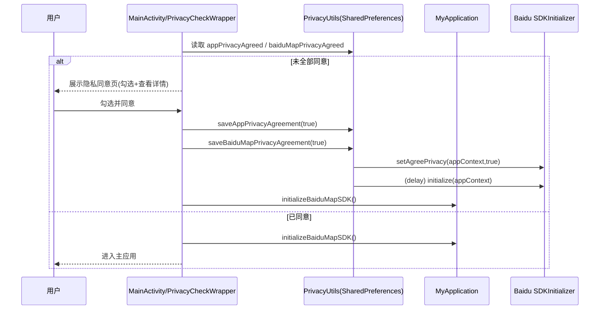

# 通用无障碍体验模块（Accessibility/通用交互层）梳理 — EarRove 聆途

本文档聚焦本项目三大模块中的**“通用无障碍体验模块”**：即贯穿导航、OCR、设置、帮助等页面的**读屏适配、隐私合规门禁、权限引导、语音/震动反馈与冲突仲裁、可达性交互规范**等通用能力。

> 代码依据来自 `app/src/main/java/com/example/earrove/` 下的 Compose UI 与 `utils/*` 工具类。

---

## 实现功能清单（按能力分组）

### 1) 读屏（TalkBack）适配与可达性语义

- **关键控件语义标注**：通过 Compose `semantics { contentDescription = ... }` 为主要交互区域提供可读描述。
  - **主页**：两张大卡片入口、底部设置/帮助按钮均有 `contentDescription`（`ui/home/HomeScreen.kt`）。
  - **导航**：麦克风、目的地展示、步骤按钮等增加语义描述（`ui/navigation/NavigationScreen.kt`）。
  - **OCR**：整体页面根据识别状态动态拼装 `accessibilityLabel` 并注入语义（`ui/ocr/OcrScreen.kt`）。
  - **通用 AppBar**：顶部栏语义描述 + 返回按钮 `contentDescription`（`ui/common/AppBar.kt`）。
- **合并语义树**：主页卡片使用 `semantics(mergeDescendants = true)`，避免读屏碎片化朗读（`ui/home/HomeScreen.kt`）。

### 2) 高对比度与简洁 UI 交互（面向低视力 + 读屏）

- **整体风格**：主题偏黑底/高对比（例如隐私同意页用 `PureBlack` 背景、金色强调；`ui/theme/*`）。
- **大触达区域**：主页卡片 padding 较大、图标大（80dp），更利于触摸探索（`ui/home/HomeScreen.kt`）。

### 3) 隐私合规门禁（首次进入的同意流程 + SDK 初始化闸门）

- **隐私同意拦截**：`MainActivity` 入口使用 `PrivacyCheckWrapper()`，在用户未同意时**先显示隐私同意页**，否则进入主应用（`MainActivity.kt`）。
- **双隐私项**：
  - **应用隐私政策**（本地说明）。
  - **百度地图 SDK 隐私政策**（导航核心依赖）。
- **同意后初始化百度 SDK**：通过 `MyApplication.initializeBaiduMapSDK()` 与 `PrivacyUtils.saveBaiduMapPrivacyAgreement()` 等逻辑，确保：
  - 先 `SDKInitializer.setAgreePrivacy(appContext, true)`
  - 再延迟初始化 `SDKInitializer.initialize(appContext)`（`PrivacyUtils.kt`、`MyApplication.kt`）。
- **不同意处理**：当前实现为“不同意即退出应用”（`MainActivity.kt`）。

### 4) 运行时权限申请与降级处理

- **统一权限集合**：位置（精确/粗略）+ 相机 + 麦克风（`utils/PermissionUtils.kt`）。
- **Compose 权限请求器**：`RequestPermissionsDialog` 使用 `ActivityResultContracts.RequestMultiplePermissions()` 自动触发申请（`utils/PermissionUtils.kt`）。
- **导航页面权限门禁**：`NavigationScreen` 在权限未授予时弹出请求（`ui/navigation/NavigationScreen.kt`）。
- **OCR 页面权限**：使用 `accompanist-permissions` 处理相机权限（见 `ui/ocr/OcrScreen.kt` 的权限状态判断）。

### 5) 多通道反馈：语音（TTS）+ 震动（Haptics）

- **TTS 双引擎（主备）**（`utils/TTSManager.kt`）：
  - **主引擎**：百度 AIPE 在线 TTS（初始化失败则降级）。
  - **备用**：Android 系统 `TextToSpeech`（中文/简中回退）。
  - **播放状态回调**：通过 listener/`UtteranceProgressListener` 实现“播放完成通知”。
  - **关键能力**：`speakAndWait(text)` —— 用于“播报并等待结束”，给仲裁器实现可控的抢占/恢复。
- **震动编码**（`utils/VibrationManager.kt`）：
  - **障碍物**：短震两次（waveform）。
  - **转向**：长震一次（500ms）。
  - **红绿灯**：三次短震（waveform）。

### 6) 资源/注意力冲突仲裁（语音抢占 + 震动同步）

- **仲裁器**：`utils/Arbitrator.kt`
  - **优先级**：`OBSTACLE`（最高）> `NAVIGATION` > `OCR` > `INFO`
  - **策略**：当正在播报且新消息优先级**不低于**当前（`ordinal` 更小 = 更高）时，**中断旧播报**并播放新消息。
  - **输出**：语音（TTS）+（可选）震动 pattern 同步触发。
- **对用户的直观效果**：
  - 障碍物警示会抢占导航播报（更安全）。
  - OCR 朗读通常不会打断障碍物/导航关键指令。

### 7) 设置与帮助（面向无障碍使用的说明与开关入口）

- **设置页（UI 已实现）**：朗读速度 slider、震动反馈 switch（`ui/settings/SettingsScreen.kt`）。
  - 备注：当前为**页面内状态**，未看到与 `TTSManager.setSpeechRate()` / `VibrationManager` / 持久化设置的连接点（属于“已展示 UI、未接入全局生效”的阶段）。
- **帮助中心**：说明导航/OCR/震动反馈（`ui/help/HelpScreen.kt`）。

---

## 资源优先级分配（“资源”= 语音通道/震动/用户注意力/计算资源）

本模块的“资源优先级”主要体现在**输出通道抢占**与**用户注意力管理**，而非 CPU 线程抢占。

### 1) 输出通道（扬声器/震动马达）优先级

在 `Arbitrator.Priority` 中定义（`utils/Arbitrator.kt`）：

- **P0 — OBSTACLE（最高）**：安全相关，允许中断其他播报；建议始终伴随震动。
- **P1 — NAVIGATION**：导航指令、红绿灯等行进关键提示；可中断 OCR/INFO。
- **P2 — OCR**：识别结果朗读；不应打断 P0/P1。
- **P3 — INFO（最低）**：欢迎语、轻提示等；任何更高优先级可抢占。

### 2) UI 交互资源（触达/读屏时间）的分配

- **信息密度控制**：通过 `mergeDescendants` 与明确的 `contentDescription` 减少 TalkBack 的碎片化朗读成本（主页等）。
- **关键交互可见性**：导航页对“麦克风开始语音输入”“目的地”“暂停/继续/结束”等都提供明确语义描述，降低学习成本。

### 3) 计算/电量（辅助说明，用于设计取舍）

从实现上看：

- **隐私门禁**避免在未同意前初始化百度 SDK（减少合规与无效初始化成本）。
- **TTS**优先百度在线，失败降级系统 TTS（可用性优先）。
- **OCR**强调“本地处理”，减少网络与隐私风险（PRD 与 `OcrScreen` 语义提示一致）。

---

## 数据流转图（Data Flow）

### 1) 通用无障碍体验的核心数据流：事件 → 仲裁 → 输出

```mermaid
flowchart LR
  subgraph UI[Compose UI 层]
    A1[触摸/点击\n(按钮/卡片/麦克风)]
    A2[读屏语义\nsemantics/contentDescription]
  end

  subgraph Gate[合规与权限门禁]
    B1[隐私同意\nPrivacyCheckWrapper]
    B2[权限申请\nRequestPermissionsDialog / accompanist]
  end

  subgraph Core[通用交互核心]
    C1[仲裁器\nArbitrator(Priority)]
    C2[TTS 管理器\nTTSManager(百度/系统)]
    C3[震动管理器\nVibrationManager]
  end

  subgraph Src[业务事件来源（示例）]
    D1[避障事件\nObstacleDetectionService]
    D2[导航事件\nNavigationService]
    D3[OCR 识别结果\nOcrScreen]
  end

  subgraph Out[输出通道]
    E1[扬声器/耳机\n语音播报]
    E2[震动马达\n编码震动]
  end

  A1 --> B1 --> B2 --> Src
  D1 --> C1
  D2 --> C1
  D3 --> C1
  C1 --> C2 --> E1
  C1 --> C3 --> E2
  A2 -.提升读屏可达性.-> UI
```

### 2) 首次进入的隐私门禁数据流



---

## 系统架构图（聚焦“通用无障碍体验模块”）

```mermaid
graph TB
  subgraph AppLayer[App 层（app 模块）]
    Main[MainActivity + NavHost]
    UIHome[HomeScreen]
    UINav[NavigationScreen]
    UIOcr[OcrScreen]
    UISettings[SettingsScreen]
    UIHelp[HelpScreen]
    AppBar[EarRoveTopAppBar]
  end

  subgraph AccessibilityCore[通用无障碍体验模块（核心实现）]
    Privacy[PrivacyUtils\n(同意状态+SDK安全初始化)]
    Perm[PermissionUtils\n(RequestMultiplePermissions)]
    TTS[TTSManager\n(百度TTS主 + 系统TTS备)]
    Vib[VibrationManager\n(障碍/转向/红绿灯编码)]
    Arb[Arbitrator\n(优先级抢占仲裁)]
  end

  subgraph Business[业务模块（事件来源）]
    NavSvc[NavigationService]
    ObsSvc[ObstacleDetectionService]
    TL[TrafficLightService]
  end

  subgraph Output[输出通道]
    Speaker[Speaker/Headset]
    Motor[Vibrator]
  end

  Main --> Privacy
  UINav --> Perm
  UIHome --> AppBar
  UINav --> AppBar
  UIOcr --> AppBar
  UISettings --> AppBar
  UIHelp --> AppBar

  Business --> Arb
  Arb --> TTS --> Speaker
  Arb --> Vib --> Motor
```

---

## 交互形式与用法说明（面向用户/测试人员）

### 1) 第一次启动（必须步骤）

- **进入应用后先看到隐私同意页**：
  - 勾选 **“EarRove 应用隐私政策”**、**“百度地图 SDK 隐私政策”**
  - 可点“查看详情”阅读条款
  - 全部勾选后按钮变为 **“同意并开始使用”**
- **不同意**：当前实现为直接退出应用。

### 2) 主页操作（两大入口 + 底栏）

- **智能导航**：进入导航页面（读屏提示“导航模式。点击进入。”）
- **文字识别**：进入 OCR 页面（读屏提示“文字识别模式。点击进入。”）
- **设置/帮助**：底栏图标可进入对应页面（均有读屏描述）。

### 3) 导航页的无障碍交互要点

- **麦克风按钮**：语义提示“**双击开始语音输入目的地**”
- **目的地展示/更改**：有语义提示“目的地：xxx”“点击此处更改目的地”
- **过程反馈**：TTS 会播报关键状态（如“正在监听，请说出目的地”“导航已暂停/继续导航”等）
- **震动反馈**：转向/红绿灯/障碍物会触发不同震动编码（由业务事件触发 + 仲裁器同步震动）。

### 4) OCR 页的无障碍交互要点

- 页面语义会根据状态变化：
  - “正在识别中，请稍候”
  - “识别结果：……”
- 拍照识别按钮有语义提示（便于 TalkBack 定位）。

### 5) 设置页

- **朗读速度 slider**：有语义提示当前值。
- **震动反馈开关**：有语义提示开启/关闭状态。
  - 备注：目前代码层面未看到该页与全局 TTS/震动管理器联动（后续可作为开发待办）。

---

## 开发情况图解（当前实现状态）

> 说明：状态依据仓库现有代码“是否已落地且可被调用”判断。

```mermaid
flowchart TB
  subgraph Done[✅ 已实现（代码可用）]
    D1[读屏语义：主页/导航/OCR/AppBar]
    D2[隐私同意门禁 + SDK 初始化闸门]
    D3[TTS 双引擎(百度主/系统备) + speakAndWait]
    D4[震动编码：障碍/转向/红绿灯]
    D5[语音/震动优先级仲裁：Arbitrator]
    D6[运行时权限申请：通用工具 + 导航页接入]
    D7[帮助中心：功能/震动说明]
  end

  subgraph Partial[🟨 部分实现/待接入（UI或局部完成）]
    P1[设置页：朗读速度/震动开关（未全局生效/未持久化）]
  end

  subgraph Todo[⬜ 建议补齐（当前代码未见/可作为后续迭代）]
    T1[全局无障碍设置持久化（SharedPreferences/DataStore）]
    T2[将“震动开关”接入 VibrationManager/仲裁器输出]
    T3[将“朗读速度”接入 TTSManager.setSpeechRate 并全局生效]
    T4[统一无障碍文案规范与国际化(strings.xml)]
    T5[更细的焦点管理：FocusRequester/读屏顺序（需要时）]
  end

  Done --> Partial --> Todo
```

---

## 附：关键实现入口索引（便于二次开发/答辩引用）

- **隐私门禁入口**：`app/src/main/java/com/example/earrove/MainActivity.kt`
- **隐私状态与 SDK 安全初始化**：`app/src/main/java/com/example/earrove/utils/PrivacyUtils.kt`、`MyApplication.kt`
- **TTS（主备 + 回调）**：`app/src/main/java/com/example/earrove/utils/TTSManager.kt`
- **震动编码**：`app/src/main/java/com/example/earrove/utils/VibrationManager.kt`
- **仲裁器（优先级抢占）**：`app/src/main/java/com/example/earrove/utils/Arbitrator.kt`
- **权限工具**：`app/src/main/java/com/example/earrove/utils/PermissionUtils.kt`
- **通用 AppBar**：`app/src/main/java/com/example/earrove/ui/common/AppBar.kt`
- **读屏语义示例**：`ui/home/HomeScreen.kt`、`ui/navigation/NavigationScreen.kt`、`ui/ocr/OcrScreen.kt`

